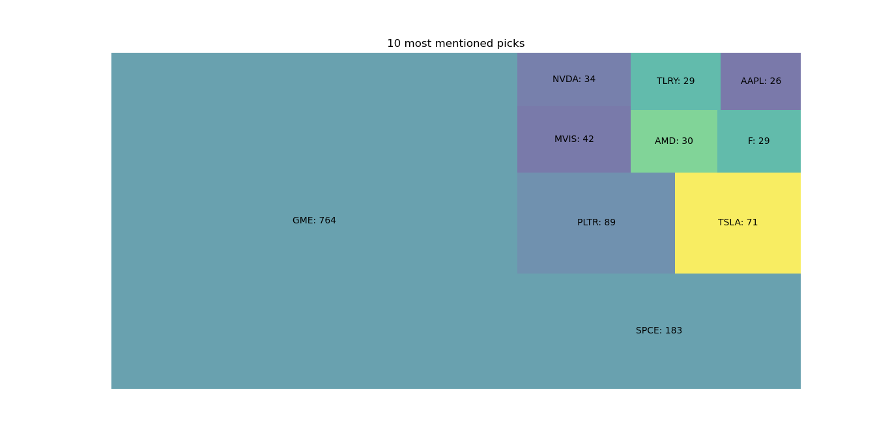
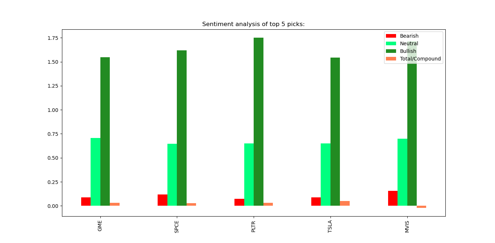

# reddit-sentiment-analysis
This program goes through reddit, finds the most mentioned tickers and uses Vader SentimentIntensityAnalyzer to calculate the ticker compound value.  

## Program Parameters
<pre>
subs = []           sub-reddit to search
post_flairs = {}    posts flairs to search || None flair is automatically considered
goodAuth = {}       authors whom comments are allowed more than once
uniqueCmt = True    allow one comment per author per symbol
ignoreAuthP = {}    authors to ignore for posts
ignoreAuthC = {}    authors to ignore for comment 
upvoteRatio = float upvote ratio for post to be considered, 0.70 = 70%
ups = int           define # of upvotes, post is considered if upvotes exceed this #
limit = int         define the limit, comments 'replace more' limit
upvotes = int       define # of upvotes, comment is considered if upvotes exceed this #
picks = int         define # of picks here, prints as "Top ## picks are:"
picks_ayz = int     define # of picks for sentiment analysis
</pre>

# How to run:
    
    pip install -r requirements.txt
    python3 reddit-sentiment-analysis.py
    
    
## Sample Output
It took 1574.61 seconds to analyze 14236 comments in 8 posts in 1 subreddits.

Posts analyzed saved in titles

10 most mentioned picks:\
GME: 764\
SPCE: 183\
PLTR: 89\
TSLA: 71\
MVIS: 42\
NVDA: 34\
AMD: 30\
F: 29\
TLRY: 29\
AAPL: 26

Sentiment analysis of top 5 picks:\
     &nbsp;&nbsp;&nbsp; &nbsp; &nbsp; &nbsp;Bearish &nbsp;Neutral &nbsp;Bullish&nbsp; Total/Compound\
GME   &nbsp; 0.087  &nbsp; 0.707  &nbsp;&nbsp; 1.548    &nbsp;&nbsp;&nbsp;      0.030\
SPCE  &nbsp; 0.119  &nbsp; 0.645  &nbsp;&nbsp; 1.618    &nbsp;&nbsp;&nbsp;      0.027\
PLTR  &nbsp; 0.073  &nbsp; 0.649  &nbsp;&nbsp; 1.751    &nbsp;&nbsp;&nbsp;      0.032\
TSLA  &nbsp; 0.088  &nbsp; 0.650  &nbsp;&nbsp; 1.543    &nbsp;&nbsp;&nbsp;      0.049\
MVIS  &nbsp; 0.155  &nbsp; 0.698  &nbsp;&nbsp; 1.714    &nbsp;&nbsp;&nbsp;     -0.020

## Data:
Includes US stocks with market cap > 100 Million, and price above $3. It doesn't include penny stocks.\
You can download data from here:\
Source (US stocks):  https://www.nasdaq.com/market-activity/stocks/screener?exchange=nasdaq&letter=0&render=download\

## License

This project is licensed under the MIT License - see the [LICENSE.md](LICENSE.md) file for details.

